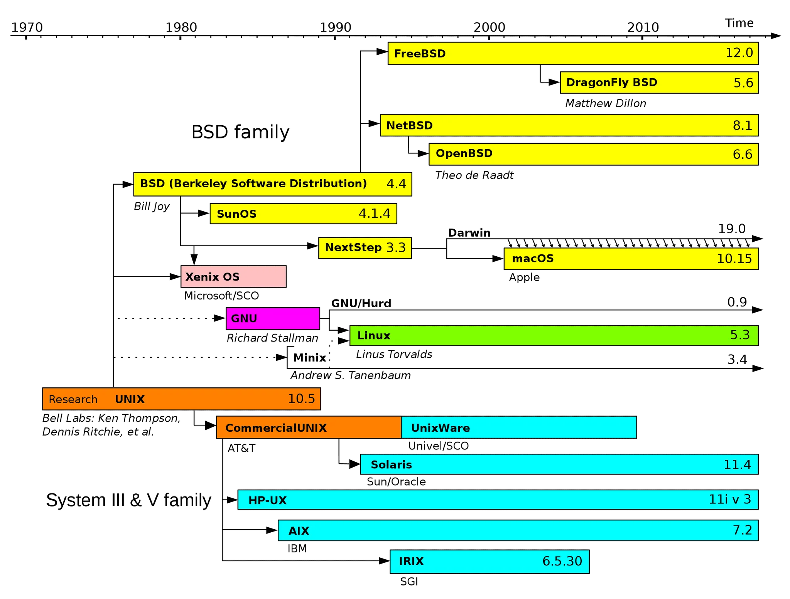

# Introduction to LINUX

- [https://opensource.com/article/18/5/differences-between-linux-and-unix](https://opensource.com/article/18/5/differences-between-linux-and-unix)
- Family tree of unix.
- MacOs is a BSD based operating system. All OS are UNIX like because they adhere to similar principles and APIs etc. But are actually separate code bases that work in different ways.
# What is Linux?

- It was made by Linus Torvalds. He created his own version of unix according to his needs.
- Almost all supercomputers runs on Linux.
- Android is also a Linux Derivative.
- Redhat and canonical are the companies completely based on Linux
- Why Linux over other OS?
    - It completely free and open-source. Saves trillions of money.
    - It has a very huge eco-system.
- There is a bit of difference between linux and distribution.
    - So all OS shares the same microkernel, i.e. the central part.
    - So all the OS that shares the same microkernels are distributions or distros like ubuntu, redhat, debian, mint etc.
    - All different distributions have different set of applications, package manager, desktop etc.
    - Ubuntu is a downstream distribution of another distribution called as [Debian](https://www.debian.org/).

# Running Linux:

- Using virtualization we can use linux ubuntu inside any OS.
- [Multipass](https://multipass.run/) is one of the option. So for Mac follow the [steps](https://multipass.run/docs/install-multipass).